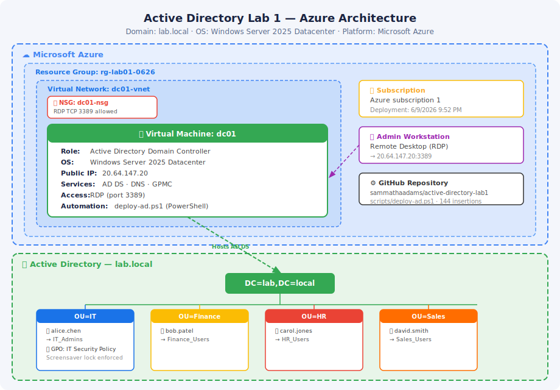

# Active Directory Lab 1 — Automated AD DS Deployment on Azure

## Overview

This lab demonstrates an enterprise-grade Active Directory Domain Services (AD DS) deployment on a Microsoft Azure Windows Server 2025 virtual machine, fully automated via PowerShell. It covers VM provisioning, domain controller promotion, organizational unit (OU) hierarchy design, security group and user provisioning, Group Policy Object (GPO) configuration, and automated audit validation — reflecting real-world sysadmin workflows in a cloud-hosted environment.

**Domain:** `lab.local`  
**Platform:** Microsoft Azure  
**OS:** Windows Server 2025 Datacenter  
**Automation:** PowerShell (`deploy-ad.ps1`)

---

## Business Context

Organizations rely on Active Directory as the backbone of identity and access management. This lab simulates standing up a new domain from scratch in a cloud environment — a task common in greenfield deployments, disaster recovery scenarios, and lab/dev environments. Automating the provisioning pipeline reduces human error, enforces consistent OU and security group structures, and provides an auditable record of configuration state.

---

## Prerequisites

- Azure subscription with permissions to create Resource Groups, VMs, VNets, and NSGs
- Windows Remote Desktop client
- PowerShell 5.1+ (available on Windows Server 2025 by default)
- Basic familiarity with Active Directory concepts (OUs, GPOs, security groups)

---

## Architecture



| Resource | Name | Type |
|---|---|---|
| Resource Group | `rg-lab01-0626` | Azure Resource Group |
| Virtual Machine | `dc01` | `Microsoft.Compute/virtualMachine` |
| Virtual Network | `dc01-vnet` | Azure VNet |
| Network Security Group | `dc01-nsg` | Azure NSG |

---

## Steps

### 1. Initialize the Project Repository

Create the local project directory, initialize Git, and scaffold the folder structure.

```powershell
mkdir active-directory-lab1
cd active-directory-lab1
git init
echo "# Active Directory Lab Portfolio" > README.md
mkdir scripts
```


---

### 2. Deploy the Azure Virtual Machine

Deploy a Windows Server 2025 VM to Azure using the portal (or CLI). The deployment provisions the VM, a VNet, and an NSG in a single operation under resource group `rg-lab01-0626`.

- **VM Name:** `dc01`
- **Subscription:** Azure subscription 1
- **Resource Group:** `rg-lab01-0626`
- **Deployment started:** 6/9/2026 9:52 PM


---

### 3. Connect via Remote Desktop (RDP)

Once the VM is running, retrieve its public IP from the Azure portal and connect using Remote Desktop.

- **Public IP:** `20.64.147.20`
- Authenticate with the local Administrator credentials set during VM creation.


---

### 4. Install AD DS and Group Policy Management Console

From an elevated PowerShell session on `dc01`, install the AD Domain Services role and the Group Policy Management Console (GPMC).

```powershell
Install-WindowsFeature -Name AD-Domain-Services -IncludeManagementTools
Install-WindowsFeature -Name GPMC
```

Both commands complete with `Success: True`.


---

### 5. Promote the Server to a Domain Controller

Run `Install-ADDSForest` to create a new forest and promote `dc01` to a domain controller for `lab.local`. The cmdlet handles DNS installation automatically.

```powershell
Install-ADDSForest -DomainName "lab.local" -InstallDNS ...
```

> **Note:** The DNS delegation warning is expected in isolated lab environments — no action required.


---

### 6. Create Organizational Units (OUs)

Provision the department OU structure under `DC=lab,DC=local` to reflect the organization's business units.

```powershell
New-ADOrganizationalUnit -Name "IT"      -Path "DC=lab,DC=local"
New-ADOrganizationalUnit -Name "Finance" -Path "DC=lab,DC=local"
New-ADOrganizationalUnit -Name "HR"      -Path "DC=lab,DC=local"
New-ADOrganizationalUnit -Name "Sales"   -Path "DC=lab,DC=local"
```

> The `Computers` OU already exists by default — the error shown is expected and non-breaking.


---

### 7. Create Security Groups

Create role-based security groups inside their respective OUs to support least-privilege access control.

```powershell
New-ADGroup -Name "IT_Admins"      -GroupScope Global -GroupCategory Security -Path "OU=IT,DC=lab,DC=local"
New-ADGroup -Name "Finance_Users"  -GroupScope Global -GroupCategory Security -Path "OU=Finance,DC=lab,DC=local"
New-ADGroup -Name "HR_Users"       -GroupScope Global -GroupCategory Security -Path "OU=HR,DC=lab,DC=local"
New-ADGroup -Name "Sales_Users"    -GroupScope Global -GroupCategory Security -Path "OU=Sales,DC=lab,DC=local"
```


---

### 8. Create User Accounts

Bulk-provision user accounts with secure passwords, placing each user in their department OU.

| Username | OU | Display Name |
|---|---|---|
| `alice.chen` | IT | Alice Chen |
| `bob.patel` | Finance | Bob Patel |
| `carol.jones` | HR | Carol Jones |
| `david.smith` | Sales | David Smith |


---

### 9. Assign Role-Based Group Memberships

Add each user to their corresponding security group to enable role-based access control (RBAC).

```powershell
Add-ADGroupMember -Identity "IT_Admins"     -Members "alice.chen"
Add-ADGroupMember -Identity "Finance_Users" -Members "bob.patel"
Add-ADGroupMember -Identity "HR_Users"      -Members "carol.jones"
Add-ADGroupMember -Identity "Sales_Users"   -Members "david.smith"
```


---

### 10. Create and Configure a Group Policy Object (GPO)

Create the `IT Security Policy` GPO, link it to the IT OU, and inject baseline security registry settings — including inactivity screensaver enforcement — to meet corporate security requirements.

```powershell
Import-Module GroupPolicy
$GPO = New-GPO -Name "IT Security Policy" -Comment "Automated Corporate IT OU Baseline Security Configuration"
New-GPLink -Name "IT Security Policy" -Target "OU=IT,DC=lab,DC=local"

# Enforce screensaver activation
Set-GPRegistryValue -Name "IT Security Policy" `
  -Key "HKCU\Software\Policies\Microsoft\Windows\Control Panel\Desktop" `
  -ValueName "ScreenSaveActive" -Type String -Value "1"

# Require password on screensaver resume
Set-GPRegistryValue -Name "IT Security Policy" `
  -Key "HKCU\Software\Policies\Microsoft\Windows\Control Panel\Desktop" `
  -ValueName "ScreenSaverIsSecure" -Type String -Value "1"
```


---

### 11. Run Automated Audit Validation

Execute the built-in audit report to verify the full deployment: domain controller status, OU hierarchy, user accounts, group nesting, and GPO inheritance.

**Domain Controller:**
| ComputerName | Operating System | Forest |
|---|---|---|
| `dc01` | Windows Server 2025 Datacenter | `lab.local` |

**OU Structure verified:** IT, Finance, HR, Sales  
**Users verified:** alice.chen, bob.patel, carol.jones, david.smith (all enabled)  
**Group nesting verified:** alice.chen → IT_Admins  
**GPO inheritance verified:** IT Security Policy → OU=IT


---

### 12. Commit and Push to GitHub

Add the deployment script to version control and push to the remote repository.

```powershell
git add scripts/deploy-ad.ps1
git commit -m "feat: complete active directory core deployment script with gpo injection automation"
git push
```


---

## Key Skills Demonstrated

- Azure VM provisioning and NSG configuration
- PowerShell automation of AD DS installation and forest promotion
- Organizational unit (OU) hierarchy design aligned to business structure
- Role-based security group provisioning
- Bulk user account creation with secure credential handling
- Group Policy Object (GPO) creation, linking, and registry-based policy injection
- Automated audit scripting with `Get-ADDomainController`, `Get-ADOrganizationalUnit`, `Get-ADUser`, `Get-ADGroupMember`, and `Get-GPInheritance`
- Git version control for infrastructure scripts

---

## Cleanup

To avoid ongoing Azure charges, deallocate or delete the `dc01` VM and associated resources from the `rg-lab01-0626` resource group when the lab is complete.

```bash
az group delete --name rg-lab01-0626 --yes --no-wait
```
